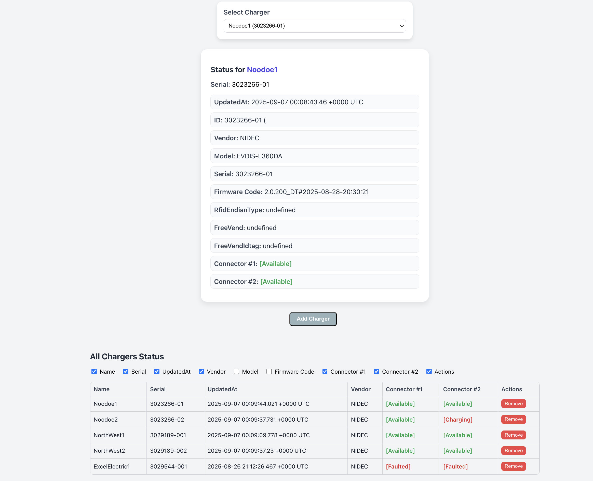

# Introduction 

A full-stack FastAPI + React web application to monitor charger status.

The app retrieves charger status and displays on dashboard.

All sources of data are publically facing.


# Tech Stack

### Backend
- FastAPI
- SQLite3
- httpx
- BeautifulSoup4
- Uvicorn

### Frontend
- React
- styled-components


# Installation 

localhost:8000

```

cd backend
python -m venv venv
source venv/bin/activate

pip install -r requirements.txt
uvicorn main:app --reload


```

localhost:3000
```

cd frontend 
npm i
npm start


```

# API endpoints

- GET /mappings list all chargers
- POST /mappings  add a new charger
- PUT /mappings/{device-name} updating an existing charger
- DELETE /mappings/{device-name} remove a charger
- GET /status/{device-name}
- GET /all Get statuses of all chargers


# Database

table - charger-mappings

```
  conn.execute("""
CREATE TABLE IF NOT EXISTS charger_mappings (
    id INTEGER PRIMARY KEY AUTOINCREMENT,
    name TEXT UNIQUE NOT NULL,
    serial TEXT UNIQUE NOT NULL,
    created_at TIMESTAMP DEFAULT CURRENT_TIMESTAMP,
    updated_at TIMESTAMP DEFAULT CURRENT_TIMESTAMP
```

# Demo
https://charger-status.onrender.com/


